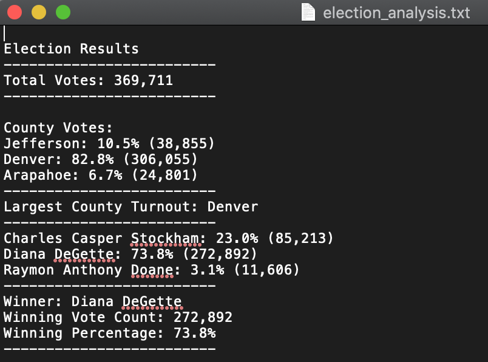

# Election Audit

## **Overview of Election Audit**

The purpose of the election audit was to identify the winner of the election based on the votes cast.  In addition to knowing the winner of the election we were also tasked with looking into the vote counts and the percentage of votes by county and candidate.  

## **Election-Audit Results**

Please see the below screen capture for the results of election_audit.

## **Election_Audit Summary**

